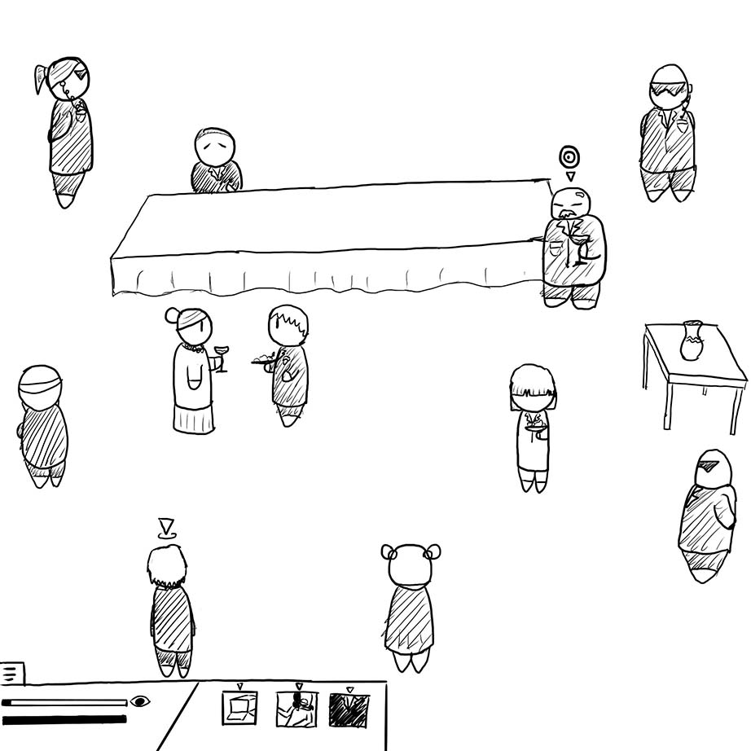
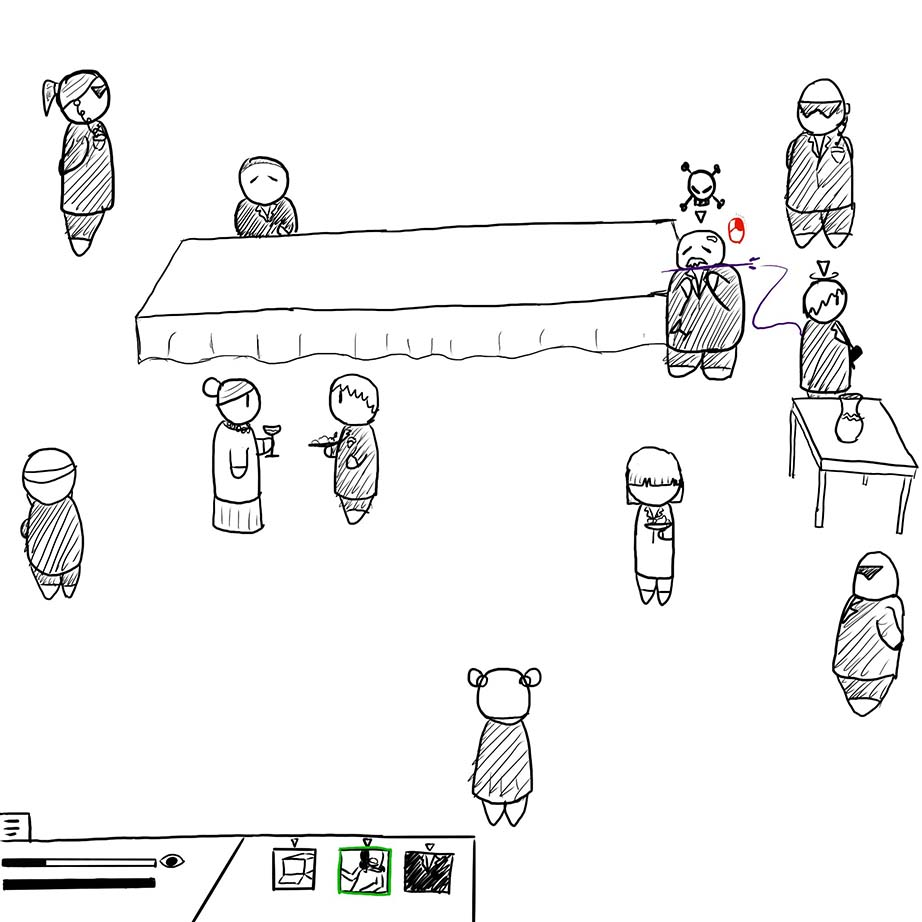

# Project Proposal
# The Elimination Project
You are an assassin for a group of rogues so good at their jobs they're basically unknown- The Elimination Project. Your goal, once you've received your mission, is to get in, eliminate your target, and get out as fast and quietly as possible. The more cleanly they're eliminated, the better for you.
## Genre
*The Elimination Project* is a top-down stealth game. You are placed in a room, with context of what your surroundings are, and given a target. It would focus on having you move around as quietly and inconspicuously as possible, striking only when necessary.
## Platform
*The Elimination Project* is primarily for desktops, however if it can be made mobile friendly it would be optimal.
## Story
In this game, you are part of a group of rogues called *The Elimination Project.* They specialize in taking out targets quickly and silently, never leaving a person alive and always going for the kill. You are a new recruit in *The Project*, and need to prove to your superiors that you are worth the trouble.
The gameplay itself is one of tense excitement. Things like moving around the room without attracting attention should be challenging but fun, and the moment where you decide how to take out the target is a selling point as well.
Because this is a smaller level web-game, at the goal is simply not to lose the trust of *The Project*. You lose their trust by either failing missions too many times or succeeding but attracting attention to yourself. The earlier levels will be easy, however the later levels will be much harder and more intense, forcing the player to become more and more clever to avoid suspicion. If the player can continue to use their mind to their advantage, they will be able to without fail climb the ranks of *The Project.* The player's goal is to eventually become the highest ranked member of *The Project* and uncover the secrets lying within the organization. If they continue to succeed mission after mission, they will quickly climb to the top. Should they fail too many times, however, they will be deemed "unworthy" and dispatched (a "Game Over").
## Aesthetics
The aesthetics are cartoonish/pixel-based, with as much detail as you can fit in a top-down game. The sound will mostly be ambient noise based on the location. A party may have soft music and chatter, a laboratory may have the bubbling of experiments. Your movement also causes noise, allowing you to tell if a guard will spot/hear you or not. Because the game has different "finishers," each one has a different sound, and at the end of each mission when your points for completion are tallied up you will hear some sort of noise as well. This noise will most likely be something like coins being counted up.
## Gameplay
### Mechanics
The gameplay consists partially of <i>Metal Gear</i> inspired mechanics such as hiding behind or under boxes, and partially of general stealth game mechanics such as blending in with crowds. If necessary you can also kill and hide bodies, however the more people you kill besides your target, the lower your score gets. There are also body guards stationed throughout most levels, and if you are seen by one you will most likely be forced to act. This could be anything from killing them to walking away or hiding, however if you are caught, you will have to restart the level. Throughout the game you can acquire different items and power-ups to help you with your missions, such as a ghillie suit or a two-piece tux. Different finishers are mostly just for show, however there are a few bosses that may be harder to kill without something besides the default finisher.
### Controls
The controls are simply keyboard and mouse (WASD to move around, and mouse click to attack or interact), however the mobile version would use dragging and some sort of touchpad.
### Teaching the Game
The tutorial for *The Elimination Project* is done in context of your final exam before going on a real mission. You are dopped in a basic level, with guards that do nothing besides turn back and forth, a target, and nothing else. Once prompted with the controls in the form of "memories," and being seen by the guards once, the game is pretty self-explanitory; as such the game shouldn't be too hard to pick up.
### Player Learning
The main thing a player needs to learn in order to play through *The Elimination Project* is using power ups and timing your movements effectively. As an example, one level may have a target that is completely alone, but in locked away in a private room. If the player simply enters it and a guard sees them, that arouses suspicion. If they enter it without a gaurd seeing you, but the target sees them, they will call for the guards. This gives the player a couple of options:

* Wait for the guard to not be looking then sneak into the room, and find a way to hide without the target noticing.
* Or, they could use a power up.
 
What power ups could the player use? Well, if they can afford to be flashy, they could use a smoke or flash grenade to distract the guards while they kill their target, although it would alert the guards to someone's presence. The player could also simply kill the guards, although <i>The Project</i> isn't exactly a fan of messy jobs. The optimal option would most likely to use an item to dress as a guard, then simply walk into the room, eliminate your target, and leave.
    
A second thing that becomes apparent in later levels is that not all targets are rich wimps sitting on a chair hoping they'll be safe. A large mafia boss, for example, may put up a struggle, or not die from the player's usual stab in the throat. Let's say the player gets into the room and hasn't yet raised the suspicion of the boss. The player has previously tried to use the finisher that stabs the target in the neck, but the target survived and fought them. Once again, the player has options. If they have poison, perhaps they could poison the target's food? Well, this will work in some levels, but other levels may have targets that have food testers. If this is the case, the player could use a *Martial Arts* killing style, which paralyzes the target, then take their time killing the target. A proper combination of items and killing styles allows players to quietly take out the targets, but figuring out what combination will work best is what makes the game interesting
## Screenshots

*An example of a basic level (left) and an example of eliminating the target on said level (right)*
## About the Developer
Youki Iimori is a 2nd year Game Design and Development major at Rochester Institute of Technology, minoring in Creative Writing. He works primarily in C#, CSS, and HTML, however he also draws in his free time and enjoys 3D modeling in Maya. In his free time he draws and plays games, with some of his favorites including Dungeons and Dragons, Magic: The Gathering, League of Legends, and Smash Bros. He hopes to become a Game Illustrator.
